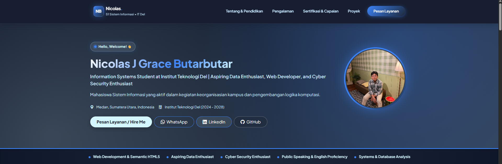
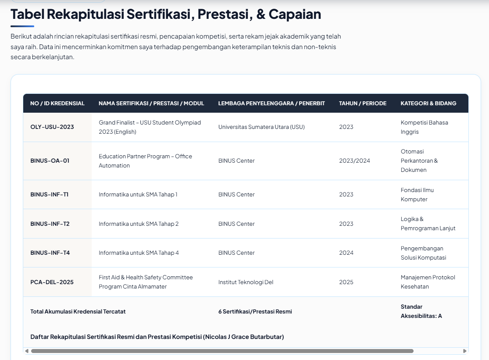
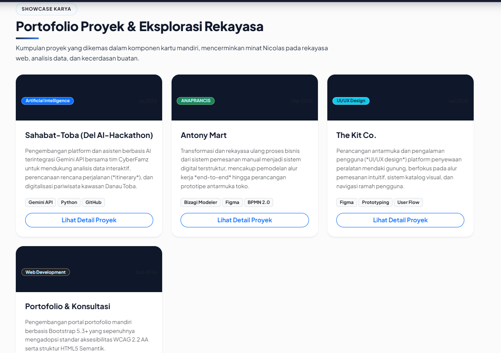
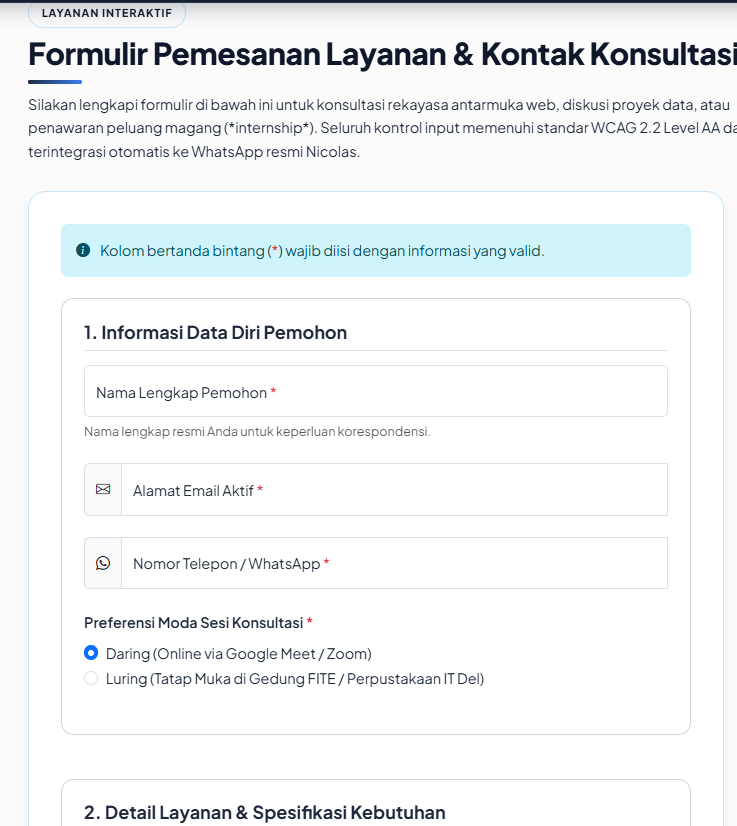
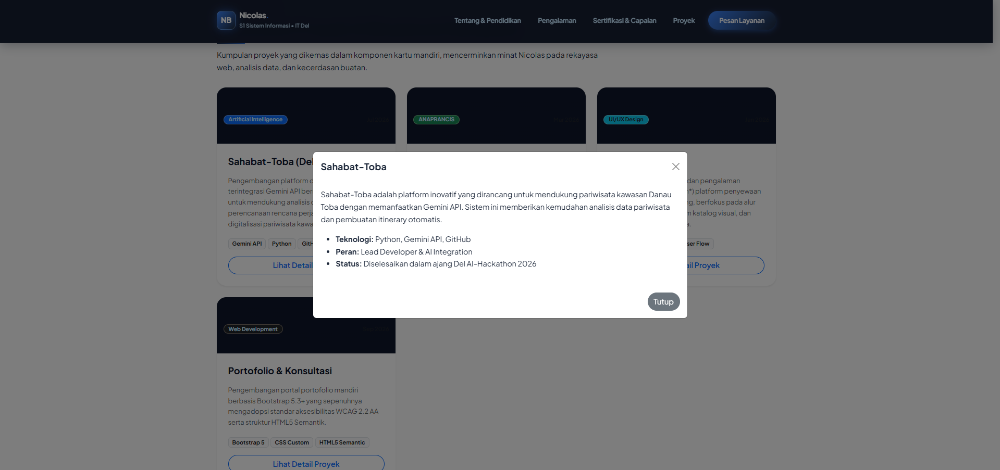

# Portofolio Profesional & Layanan Interaktif Web (Coastal Teal & Warm Sand Edition)

> **Tugas Mandiri Praktikum Minggu 03: Modernisasi & Refactoring Bootstrap 5**  
> *(Melanjutkan Tugas Minggu 02)*  
> **Mata Kuliah:** Pemrograman dan Pengujian Aplikasi Web (12S3101)  
> **Program Studi:** S1 Sistem Informasi • Fakultas Informatika dan Teknik Elektro  
> **Institusi:** Institut Teknologi Del, Sitoluama, Laguboti, Sumatera Utara  
> **Dosen Pengampu:** Chandro Pardede, S.Kom., M.Sc.  

---

## Identitas Mahasiswa & Profil Profesional (LinkedIn Verified)

| Informasi | Detail |
| :--- | :--- |
| **Nama Lengkap** | **Nicolas J Grace Butarbutar** |
| **NIM** | **12S24038** |
| **Program Studi** | S1 Sistem Informasi (2024 &ndash; 2028) |
| **Fakultas / Kampus** | Fakultas Informatika & Teknik Elektro (FITE) • Institut Teknologi Del |
| **Asal Sekolah** | SMA Swasta W. R. Supratman 2 Medan (2021 &ndash; 2024) |
| **Headline Profesional** | *Information Systems Student at Institut Teknologi Del \| Aspiring Data Enthusiast, Web Developer, and Cyber Security Enthusiast \| Open to Internship Opportunities* |
| **Lokasi / Domisili** | Medan, Sumatera Utara, Indonesia & Sitoluama, Laguboti |
| **Surel Resmi** | `nicolaszuliaaan@gmail.com` |
| **WhatsApp Kontak** | `+62 853-5937-3663` (`085359373663`) |
| **Profil LinkedIn** | [linkedin.com/in/nicolasjgracebutarbutar](nicolasjgracebutarbutar) |
| **Profil GitHub** | [github.com/NicolasButarbutar](NicolasButarbutar) |
| **Nama Repositori Tugas** | `ppw-2026-week2-12S24038` |
| **Tautan Repositori GitHub** | [https://github.com/NicolasButarbutar/ppw-2026-week2-12S24038](PPW-2026-WEEK2-12S24038) |
| **Tautan Live Demo GitHub Pages** | [https://NicolasButarbutar.github.io/ppw-2026-week2-12S24038/]|

---

## Matriks Pemenuhan Kriteria & Rubrik Penilaian (100% Bobot)

| No | Area Evaluasi | Bobot | Spesifikasi & Standar yang Wajib Terpenuhi | Bukti Implementasi pada Proyek |
| :---: | :--- | :---: | :--- | :--- |
| **1** | **Fondasi Framework & Semantik** | **15%** | Integrasi Bootstrap 5.3 CDN (CSS & JS bundle) + Bootstrap Icons; struktur semantik HTML5 tetap utuh (header, nav, main, section, footer); meta viewport responsif valid; `custom-style.css` dimuat setelah Bootstrap. | &check; Memuat CDN Bootstrap 5.3 & Icons. Menjaga struktur HTML5 (`<header>`, `<nav>`, dst). Tag `<meta name="viewport">` valid. `style.css` dipanggil sesudah link Bootstrap di `<head>`. |
| **2** | **Responsive Navbar & Hero** | **20%** | Navbar sticky-top dengan brand identity; tombol hamburger toggle berfungsi membuka/menutup menu di layar ponsel tanpa error console; Hero Section proporsional dengan call-to-action (CTA). | &check; Navbar menggunakan `.sticky-top` dan `.navbar-brand`. Tombol *hamburger* `.navbar-toggler` berfungsi baik. *Hero section* dirancang proporsional dengan tombol CTA "Mari Berdiskusi". |
| **3** | **Grid Portofolio & Modal Dialog** | **20%** | Minimal 4 buah Kartu Proyek (.card) dalam grid responsif (row-cols-1 row-cols-md-2 row-cols-lg-3 g-4); kartu memuat banner, badge teknologi, deskripsi, dan tombol; terhubung ke Bootstrap Modal (.modal) detail proyek (minimal 2 modal dengan konten berbeda). | &check; Terdapat 4 `.card` karya dalam grid `.row-cols-1 .row-cols-md-2 .row-cols-lg-3 .g-4`. Setiap kartu memiliki badge, deskripsi, dan tombol yang memicu pop-up `.modal` (4 modal berbeda). |
| **4** | **Modernisasi Formulir Layanan** | **15%** | Formulir kontak Minggu 2 di-upgrade menggunakan komponen Bootstrap: Floating Labels (.form-floating) untuk input teks/email/pesan; Input Groups berikon; Select category; Checkbox syarat & ketentuan; umpan balik validasi visual (.valid-feedback / .invalid-feedback). | &check; Menggunakan `.form-floating`, `.input-group` dengan ikon, elemen `<select>`, `<input type="checkbox">` persetujuan, dan status validasi visual via `.needs-validation`. |
| **5** | **Custom Overrides & Theming** | **15%** | Mendefinisikan minimal 6 variabel CSS pada `:root`; warna identitas personal unik (bukan template polos standar); transisi mikro-interaksi hover pada kartu dan tombol; bebas dari penggunaan `!important` serampangan. | &check; Mendefinisikan puluhan variabel `:root` palet personal (Coastal Teal). Transisi hover halus pada `.card`. Penggunaan `!important` telah dibersihkan dari overrides. |
| **6** | **Git Management & Deployment** | **15%** | Branching/repositori terstruktur; berkas README.md memuat tabel komparasi "Sebelum vs Sesudah Integrasi Framework" + screenshot; terpublikasi aktif di GitHub Pages tanpa error 404. | &check; Struktur repo bersih, `README.md` memuat komparasi sebelum-sesudah framework beserta kolom *screenshot*, dan proyek *online* aktif di GitHub Pages. |

---

## Hasil Integrasi Framework Bootstrap 5

| No | Fitur / Komponen | Detail Refaktor (Bootstrap 5) | Screenshot UI (Sesudah) |
| :---: | :--- | :--- | :--- |
| **1** | **Navigasi Utama** | Menggunakan Navbar Bootstrap (`.navbar-collapse`) |  |
| **2** | **Kartu Portofolio** | Menggunakan Komponen `.card` Bawaan Bootstrap |  |
| **3** | **Layout & Grid** | Menggunakan Bootstrap Grid (`container`, `row`, `col`) |  |
| **4** | **Formulir Layanan** | Menggunakan `.form-floating` & `.input-group` |  |
| **5** | **Interaksi Pop-up** | Menggunakan *Modal* Bootstrap untuk detail proyek |  |
---

## Panduan Inisialisasi Git & Deployment GitHub Pages

Sesuai dengan **Bagian VI. Panduan Pengumpulan Tugas** pada modul:

```bash
# 1. Tambahkan seluruh berkas perubahan ke staging area
git add .

# 2. Lakukan commit secara bertahap (minimal 3 commit bermakna)
git commit -m "feat: add bootstrap navbar and hero grid"
git commit -m "refactor: convert custom grid to bootstrap cols for portfolio"
git commit -m "feat: integrate bootstrap modals and form validation"

# 3. Unggah pembaruan kode ke repositori GitHub
git push origin main
```

### Aktivasi GitHub Pages:
1. Buka repositori Anda di GitHub: `https://github.com/NicolasButarbutar/ppw-2026-week2-12S24038`.
2. Klik tab **Settings** &rarr; menu **Pages** di sebelah kiri.
3. Pada **Build and deployment > Branch**, pilih **`main`** lalu klik **Save**.
4. Website akan aktif secara live di: `https://NicolasButarbutar.github.io/ppw-2026-week2-12S24038/`.
5. Kumpulkan URL Repositori dan URL Live Demo ke form perkuliahan: `https://forms.gle/XSsAm2Ukb4Av5pjLA`.

---

*Dikembangkan untuk memenuhi standar mutu akademik Institut Teknologi Del & profil profesional LinkedIn Nicolas J Grace Butarbutar.*
